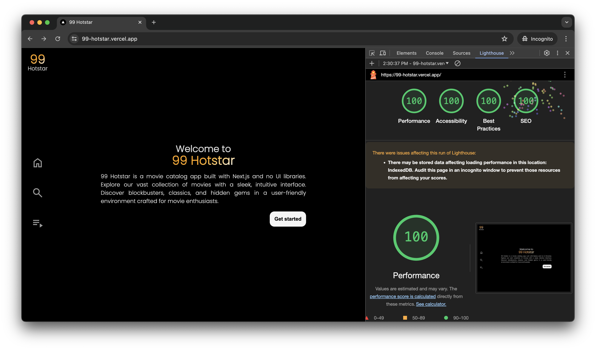
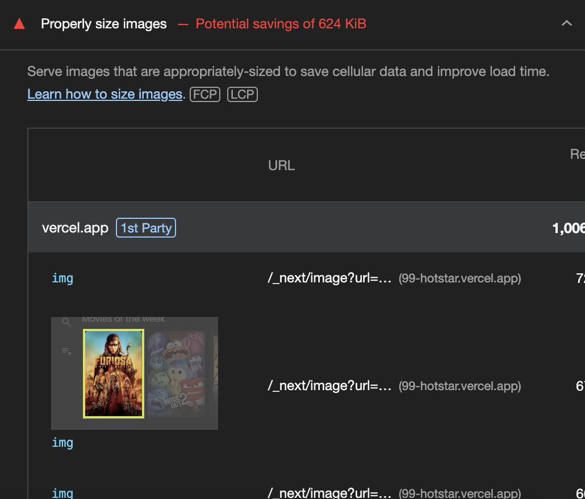
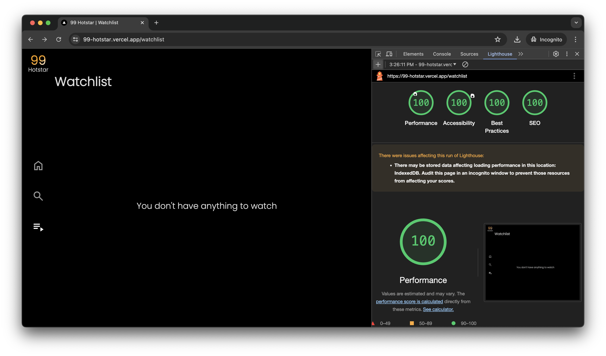
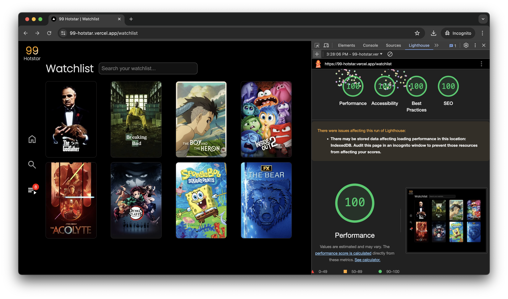
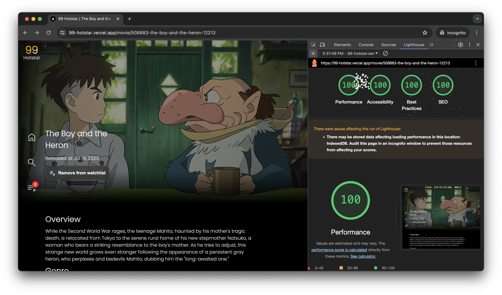
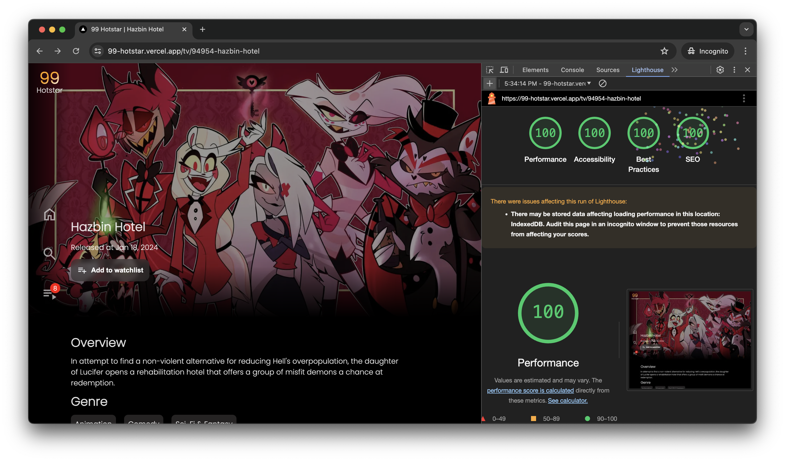
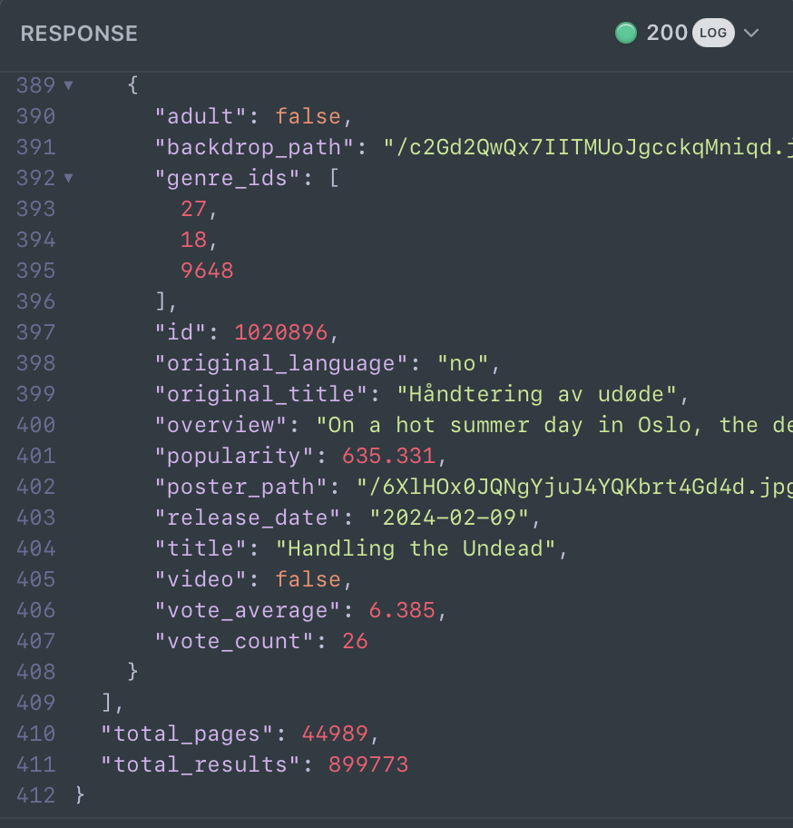

[](https://github.com/azharizkita/99-hotstar/actions/workflows/playwright.yml)

## Getting Started

Here is several guide to show or test 99 Hotstar

### Requirements

1. `pnpm Install`
1. Make your [TMDB API key](https://developer.themoviedb.org/reference/intro/getting-started)
1. Make a file called `.env.local` and put this variable:

```env
NEXT_PUBLIC_TMDB_BEARER="Bearer {CHANGE WITH YOUR BEARER TOKEN}"
```

### Running the app

1. Run the development server:

```bash
pnpm dev
```

2. Open [http://localhost:3000](http://localhost:3000) with your browser, and you will be greeted with a "Welcome to 99 Hotstar" message.

### Testing app

1. Run the development server:

```bash
pnpm dev
```

2. Run this command on the root project folder:

```
pnpm exec playwright test
```

## Technical Decision

This section is supposed to give readers context of "why" about my technical decisions. I will separate my tech decisions into several chapters:

1. ISR, SSR, SSG, or CSR
2. Data fetching strategy
3. Asset optimizations and Preloading
4. Inline CSS and CSS modules
5. End to end over unit test

### Chapter 1: ISR, SSR, SSG, or CSR

In this case, I actually use all the techniques for each page based on their own needs. Here is the breakdown:

#### Landing page

```
99-hotstar.vercel.app/
technique: SSG
```

Since the content of my landing page is always static, I made the page entirely SSG (static site generated).

This decision brought us to a stable and performant page. Here is the result of the Lighthouse test:



#### Home page

```
99-hotstar.vercel.app/home
technique: ISR
```

The home page is different from the landing page because it consists of several data fetching requirements such as movies and TV shows.

This decision brought us to a stable and performant page. Here is the result of the Lighthouse test:


Although the performance might not achieve a 100 mark on Lighthouse due to image sizes, all assets have been optimized into WebP format. Here is the reason why the home page does not achieve a 100 mark:

<details>
  <summary>Please note that the performance mark might be affected by internet speeds.</summary>
  
  
</details>

#### Search page

```
99-hotstar.vercel.app/search
technique: CSR
```

Since my search page only shows an input field and the searched content, it is most suitable to make the content of the page fully CSR because it needs the context of user input and dynamic fetching of user inputs.

This decision brought us to a stable and performant page. Here is the result of the Lighthouse test:


Here is a demo when you search something on the search page:

> Please note how the input is debounced (delayed) so it doesn't do unnecessary fetches before the user finishes their input.


#### Watchlist page

```
99-hotstar.vercel.app/watchlist
technique: CSR
```

This one obviously needs to be an CSR page because we need to get the context of the user's local storage.

This decision brought us to a stable and performant page. Here is the result of the Lighthouse test:



And here is the performance if you have something on your watchlist:



#### Movie and TV page

```
movie: 99-hotstar.vercel.app/movie/[id-slug]
tv: 99-hotstar.vercel.app/tv/[id-slug]
technique: SSR
```

The movie and TV page is basically a page to show specific details of a movie or TV show that the user selects. So I decided to make this page SSR to avoid static route generation.

I will elaborate on my decision about the Movie and TV Show pages later in the data fetching strategy chapter so you get the context of why I do SSR for these specific pages.

This decision brought us to a stable and performant page. Here is the result of the Lighthouse test:

Movie page:



TV page:



## Data fetching strategy

Here is some knowledge for you to keep in mind:

1. TMDB is a platform where users can add any movies at any time based on [TMDB's account FAQ](https://www.themoviedb.org/faq/account).
2. Based on [this discussion thread](https://www.themoviedb.org/talk/5277d248760ee3397030c549), the database of TMDB is updated every 24-hour cycle.
3. TMDB has a massive list of movies. Here is what I found when trying [their API](https://developer.themoviedb.org/reference/discover-movie):



> Let's not forget that this number is just for movies alone.

These three points help me to think and treat 99 Hotstar as a "blog-like" app, where the user posts one entry every day and it is available for millions of users.

Code-wise, I made the fetch function hardcoded to revalidate every 20 hours. Here is a sneak peek of `src/utils/fetch.ts`:

```ts
import { TMDB_BEARER_TOKEN } from "@/constants/tmdb";

const revalidateTime = 3600 * 20;

const fetchData = async <T>({
  destination,
  query,
}: {
  destination: string;
  query: string;
}): Promise<T> => {
  const headers = {
    accept: "application/json",
    Authorization: TMDB_BEARER_TOKEN || "",
  };
  const response = await fetch(
    `https://api.themoviedb.org/3/${destination}?${query}`,
    {
      method: "GET",
      headers,
      next: { revalidate: revalidateTime },
    },
  );

  const data: T = await response.json();
  return data;
};

export default fetchData;
```

It caches every `GET` request like top-rated movies, TV shows, and even search results.

#### Movie and TV show elaboration

After learning about the TMDB API and understanding a bit about user behavior, I don't think it is a good practice to cache over 899,773 pages (which does not include TV shows). Instead, I cache the movie or TV show data based on user visits for the next 20 hours.

Besides, I don't think every movie or TV show will be visited by users.

### Conclusion

My decision made it possible for 99 Hotstar to load fast and achieve a 100 Lighthouse performance mark on most pages.

## Asset optimizations and Preloading

Asset optimization might be the most important aspect of web optimization nowadays.

Let's imagine you have millions of visits each hour and you host an app like 99 Hotstar that mostly shows images. Your environment's outgress would explode if you serve the original assets.

Let's assume the original image of a poster is 250KB, and you have 10,000 requests per second. This totals 2.5GB outgress out of your server each second just for one asset.

Of course, you can just use a CDN to host your assets, but in this case for 99 Hotstar, since it is not yet a big or popular app, I do small optimizations via the `next/image` component.

Basically, it transforms the original PNG images into WebP format for smaller file size while still maintaining the looks. Here is the sneak peek of my `<Image />` component in `src/components/base/Image/index.tsx`:

```tsx
import NextImage, { type ImageProps } from "next/image";
import placeholder from "./placeholder.png";
import { TMDB_IMAGE_BASE_URL } from "@/constants/tmdb";

interface ImageLoaderProps
  extends Omit<ImageProps, "alt" | "src" | "height" | "width"> {
  src?: string;
  alt?: string;
  isBackground?: boolean;
}

export default function Image(props: ImageLoaderProps) {
  const { alt = "", src: _src, priority, isBackground, ...restProps } = props;
  const src =
    _src === "#" || !_src
      ? placeholder
      : `${TMDB_IMAGE_BASE_URL}/${isBackground ? "w1280" : "w500"}${_src}`;

  const isPrioritized = isBackground || priority;
  return (
    <NextImage
      fill
      priority={isPrioritized}
      alt={alt}
      src={src}
      loading={isPrioritized ? "eager" : "lazy"}
      {...(!isPrioritized && {
        blurDataURL: placeholder.blurDataURL,
        placeholder: "blur",
      })}
      {...restProps}
    />
  );
}
```

This code transforms any original PNG from TMDB assets into WebP format and stores the WebP format in the server environment.

Aside from file size optimization, you may see the `priority` prop which lets the image be preloaded. I use this for backgrounds and priority views such as top-rated movies and TV shows that are visible on the first page load.

This approach allows 99 Hotstar to achieve a 100 Lighthouse performance mark by reducing LCP and CLS.

## Inline CSS and CSS modules

If you see the source code, you might wonder why several components are using both CSS modules and inline CSS. To answer why, I always have this thought:

> HTML is like the materials of a building, and CSS is the cement that holds it all together. Without CSS, the structure would just fall apart and look like a mess.

For context, you can read [this web.dev](https://web.dev/articles/critical-rendering-path/render-blocking-css) article.

The idea is to make the "structural" instructions for my HTML to be available as soon as possible. While sometimes your internet might be slow, the pages might not look as expected, just as described in [this web.dev](https://web.dev/articles/critical-rendering-path/render-blocking-css) article.

So my approach is to make the CSS inline with the HTML.

This has proven to help 99 Hotstar perform well in CLS metrics via Lighthouse performance measures.

## End to end over unit test

In this case, I went with E2E testing over unit tests because the components are changing frequently. E2E tests work great for regression testing, making sure everything still works together despite the changes. They save us time from writing and maintaining tons of unit tests while still giving us confidence that the app functions correctly.
